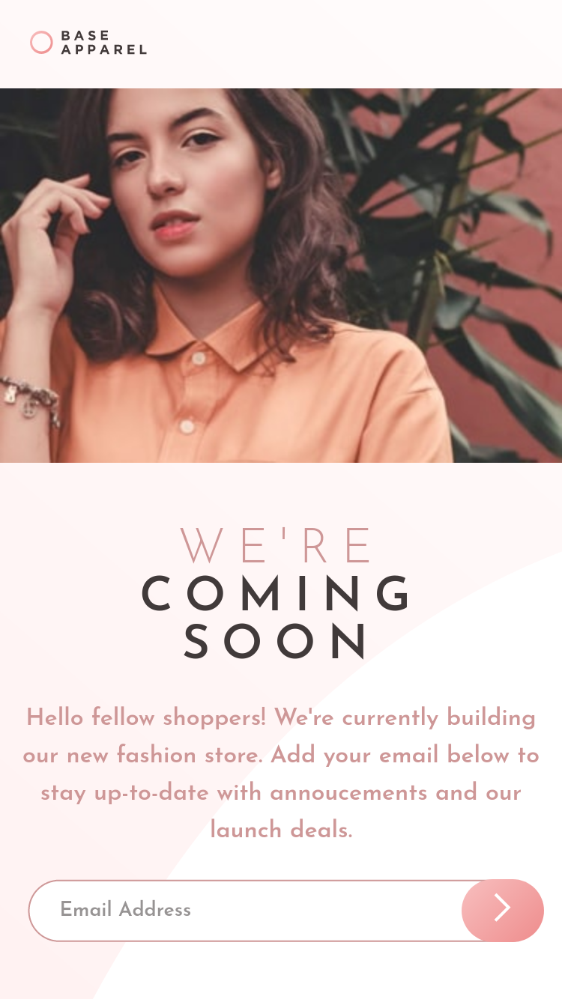
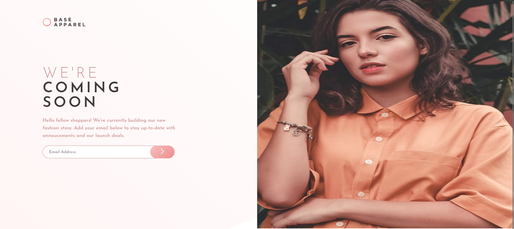

<h1>Base Apparel Coming Soon Frontend Mentor Project</h1>

## Mobile 375px

## Desktop 1440px

## Colors

**Desaturated Red**: hsl(0, 36%, 70%)   
**Soft Red**: hsl(0, 93%, 68%)   
**Dark Grayish Red**: hsl(0, 6%, 24%)   

## Gradients

Linear, 135deg, from hsl(0, 0%, 100%), to hsl(0, 100%, 98%)  
Linear, 135deg, from hsl(0, 80%, 86%), to hsl(0, 74%, 74%)  

## Font Family  

Family: [Josefin Sans](https://fonts.google.com/specimen/Josefin+Sans)

Weights: 300, 400 and 600

